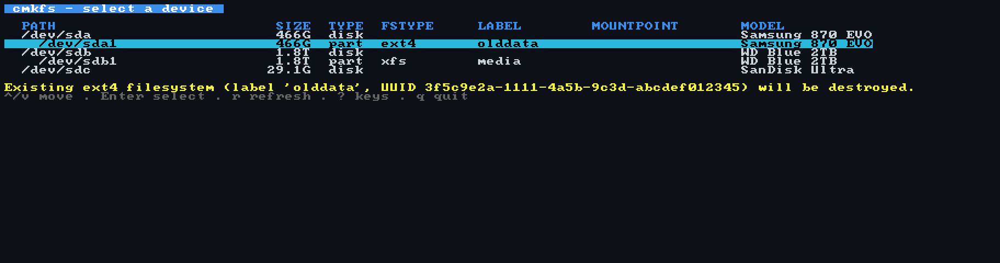

# cmkfs

A terminal UI front-end for the `mkfs.*` family of filesystem creation
tools, in the same spirit that `cfdisk` is a TUI front-end for disk
partitioning.



cmkfs guides you through selecting a block device, choosing a filesystem
(ext4, XFS, Btrfs, FAT32/vfat, exFAT, or F2FS), configuring a curated set
of options with built-in help, previewing the exact `mkfs.*` command that
will run, and executing it with live output.

cmkfs never implements filesystem creation itself. It is a command generator
and executor: its entire job is to build a correct argv for the system's
`mkfs.*` binary and run it as a subprocess. No shell is ever involved.

## Installation

Pre-built **static** binaries for Linux amd64 and arm64 are attached to every
[release](https://github.com/ethanpil/cmkfs/releases). Each block below is
copy-paste ready: the first line resolves the latest release version
automatically (set `VER` by hand instead to pin a specific one), and swap
`amd64` for `arm64` on ARM.

**Debian / Ubuntu (`.deb`)**

```sh
VER=$(curl -fsSL https://api.github.com/repos/ethanpil/cmkfs/releases/latest | sed -n 's/.*"tag_name": *"v\([^"]*\)".*/\1/p')
curl -LO https://github.com/ethanpil/cmkfs/releases/download/v$VER/cmkfs_${VER}_linux_amd64.deb
sudo dpkg -i cmkfs_${VER}_linux_amd64.deb
```

**Fedora / RHEL / openSUSE (`.rpm`)**

```sh
VER=$(curl -fsSL https://api.github.com/repos/ethanpil/cmkfs/releases/latest | sed -n 's/.*"tag_name": *"v\([^"]*\)".*/\1/p')
curl -LO https://github.com/ethanpil/cmkfs/releases/download/v$VER/cmkfs_${VER}_linux_amd64.rpm
sudo rpm -i cmkfs_${VER}_linux_amd64.rpm
```

**Alpine (`.apk`)** — the package is unsigned, so `--allow-untrusted` is required:

```sh
VER=$(curl -fsSL https://api.github.com/repos/ethanpil/cmkfs/releases/latest | sed -n 's/.*"tag_name": *"v\([^"]*\)".*/\1/p')
curl -LO https://github.com/ethanpil/cmkfs/releases/download/v$VER/cmkfs_${VER}_linux_amd64.apk
sudo apk add --allow-untrusted ./cmkfs_${VER}_linux_amd64.apk
```

**Any distro (tarball)**

```sh
VER=$(curl -fsSL https://api.github.com/repos/ethanpil/cmkfs/releases/latest | sed -n 's/.*"tag_name": *"v\([^"]*\)".*/\1/p')
curl -LO https://github.com/ethanpil/cmkfs/releases/download/v$VER/cmkfs_${VER}_linux_amd64.tar.gz
tar xzf cmkfs_${VER}_linux_amd64.tar.gz
sudo install -m 0755 cmkfs /usr/local/bin/
```

**From source** (Go ≥ 1.25, no cgo):

```sh
git clone https://github.com/ethanpil/cmkfs
cd cmkfs
CGO_ENABLED=0 go build -o cmkfs ./cmd/cmkfs
sudo install -m 0755 cmkfs /usr/local/bin/
```

## Usage

```
sudo cmkfs                 # full flow starting at the device list
sudo cmkfs /dev/sdb1       # skip the device list (all safety checks still apply)
sudo cmkfs -p /dev/sdb1    # after confirmation, print the command instead of running it
sudo cmkfs --show-loop     # include loop devices in the list
cmkfs --version            # version, commit, embedded schema ids
```

There is deliberately no `--yes` / non-interactive mode: scripting users
should use `mkfs` directly — press `p` on the confirm screen (or use
`--print`) and cmkfs hands you the exact, copy-paste-runnable command.

## Requirements

- Linux (amd64 or arm64). The release binary is fully static.
- Root (`sudo cmkfs`).
- `lsblk` from util-linux ≥ 2.33 (present on effectively every system).
- Whichever backends you want to use: `mkfs.ext4` (e2fsprogs),
  `mkfs.xfs` (xfsprogs), `mkfs.btrfs` (btrfs-progs), `mkfs.fat`
  (dosfstools), `mkfs.exfat` (exfatprogs — the modern kernel-exFAT tools,
  not the legacy fuse exfat-utils), `mkfs.f2fs` (f2fs-tools). Missing
  backends are simply greyed out in the picker.
- A terminal of at least 80x24. Serial/VM consoles that advertise a
  colorless `TERM` (vt100/vt220, common under QEMU/UTM) get basic colors
  forced automatically; `NO_COLOR=1` disables colors anywhere and
  `CLICOLOR_FORCE=1` forces them anywhere.

## Keys

| Key | Action |
|---|---|
| ↑/↓, j/k | Move selection |
| Enter | Select / advance |
| Esc | Back one screen (disabled during execution) |
| q, F10 | Quit (confirmation prompt once past the filesystem pick) |
| ? | Help overlay |
| r | Refresh device list (Screen 1) |
| h | Extended help for the focused option (Screen 3) |
| a | Advanced — Extra Arguments (Screen 3) |
| p | Print the command and exit instead of executing (Screen 4) |

## Exit codes

| Code | Meaning |
|---|---|
| 0 | Normal exit (including "backend ran and failed" — reported in-UI) |
| 2 | Usage error |
| 3 | Environment error (lsblk missing/unparseable, no TTY) |
| 4 | Not root |
| 5 | Positional device argument is blocked by a safety finding |
| 6 | Internal error |

## Safety

- Refuses mounted devices, active swap, and read-only devices.
- Refuses anything backing the running system (`/`, `/boot`, `/boot/efi`, `/usr`).
- Detects devices held by LVM, dm-crypt, md, or multipath (transitively).
- Detects existing filesystem signatures and partition tables; overwriting
  them requires typing the device name, and only then is the backend's
  force flag injected. (FAT tools overwrite signatures unconditionally and
  have no force flag — there the typed confirmation is the guard.)
- Always shows the exact command before execution.
- Re-checks everything immediately before spawning `mkfs`: if the device was
  mounted, changed, or claimed between your confirmation and execution, the
  run is aborted (nothing ever executes against a stale confirmation).
- A single Ctrl+C never kills a running format; a deliberate
  double-Ctrl+C + typed `ABORT` flow always can.

## Development

Build from source with `CGO_ENABLED=0 go build ./cmd/cmkfs` (see
[Installation](#installation)). Go ≥ 1.25; the only third-party dependencies
are the Charm TUI modules (bubbletea, bubbles, lipgloss) — everything else is
the standard library.

Run the test suite:

```
go test ./...                                   # unit tests, no root needed
sudo go test -tags integration ./integration/   # loop-device tests, root + Linux
```

Regenerate the demo GIF at the top of this README (renders the real UI
against sample devices, no root or real disks needed):

```
go run ./internal/gendemo docs/demo.gif
```

## Changelog

**v0.2.1** — fixes from a post-release review: `-I` for mkfs.fat is now
supplied for any whole device carrying a partition table (partitioned loop
devices and md arrays, not only disks); `-I` can no longer be smuggled in
via Extra Arguments; exFAT labels accept 11 characters (not 11 bytes) and
F2FS labels up to 512 bytes; the F2FS version probe was removed (mkfs.f2fs
offers no safe way to print its version, so the permanent "version could
not be determined" warning was noise); backend probes now run concurrently
at startup.

**v0.2.0** — three new filesystems: FAT32/vfat (`mkfs.fat`), exFAT
(`mkfs.exfat`, requires exfatprogs), and F2FS (`mkfs.f2fs`). FAT and exFAT
tools overwrite existing signatures unconditionally (they have no force
flag), so for those the typed device-name confirmation is the guard; on
whole-disk FAT targets cmkfs supplies `-I` automatically after
confirmation. The manual hardware checklist from the beta still has not
been signed off.

**v0.1.0-beta.1** — first beta: the automated suites (unit, fuzz,
loop-device integration) pass in CI, but the manual hardware checklist
(real USB sticks, live abort testing, terminal-resize scenarios) has not
been signed off yet. Treat it accordingly — and read the confirm screen
before typing the device name.
